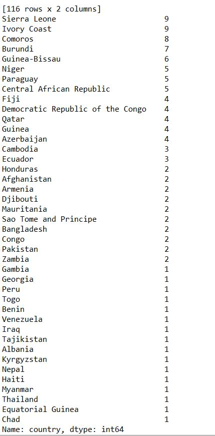
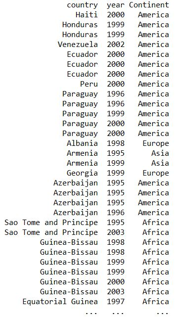
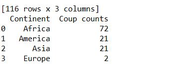
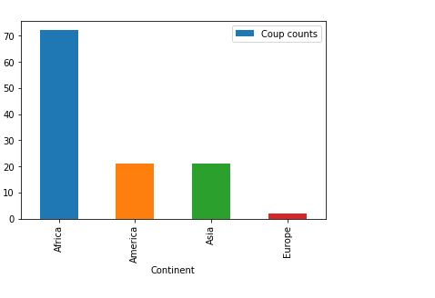

# Coup-Count-Analyzing

Here we take data from Powell, Jonathan & Clayton Thyne's work 'Coups in the World 1950-Present' [1]. 
With the help of this data, we take a subset of all the data, starting from year 1995 and with the help of Python 2.0, 
data are analyzed and 'continents' are added according to 'country names'.

Secondly, plotting continent vs coup count into a bar chart show that which continent has faced more coups.  
Python Code:
import pandas as pd;import numpy as np;

data = pd.read_csv('D:/Q3/PSCI/New folder/us.csv', sep=",", header=None, names=["country", "year"]);data['year'] = data['year'].astype(int)

indexNames = data[ data['year'] < 1995 ].index;data.drop(indexNames , inplace=True);
print(data);
dt=data['country'].value_counts();print(dt);
asia = ['Afghanistan', 'Bahrain','Bangladesh','Pakistan', 'United Arab Emirates','Saudi Arabia','Qatar','Armenia', 'Kuwait','Myanmar','Thailand', 'Cambodia','Nepal', 'Oman', 'Sultanate of Oman','Lebanon', 'Iraq', 'Yemen', 'Pakistan','Tajikistan', 'Lebanon','Kyrgyzstan', 'Philippines', 'Jordan']

europe = ['Albania','Germany','Spain', 'France', 'Italy', 'Netherlands', 'Norway', 'Sweden','Czech Republic', 'Finland', 'Denmark', 'Czech Republic', 'Switzerland', 'UK', 'UK&I', 'Poland', 'Greece','Austria', 'Bulgaria','Georgia', 'Hungary', 'Luxembourg', 'Romania' , 'Slovakia', 'Estonia', 'Slovenia','Portugal', 'Croatia', 'Lithuania', 'Latvia','Serbia', 'Estonia', 'ME', 'Iceland' ]

africa = ['Niger','Guinea-Bissau','Morocco','Equatorial Guinea','Guinea','Chad','Togo','Zambia','Gambia','Benin','Congo','Sao Tome and Principe','Djibouti','Mauritania','Democratic Republic of the Congo','Central African Republic', 'Tunisia', 'Africa', 'ZA', 'Kenya','Sierra Leone','Ivory Coast','Burundi','Comoros']america = ['USA', 'Cuba','Paraguay','Fiji','Venezuela','Peru', 'Azerbaijan','Honduras','Haiti', 'Ecuador']

continents = {country: 'Asia' for country in asia}continents.update({country: 'Europe' for country in europe})continents.update({country: 'Africa' for country in africa})continents.update({country: 'America' for country in other})

data['Continent'] = data['country'].map(continents)print(data)
indexNames = data[ data['year'] < 1995 ].index;data.drop(indexNames , inplace=True);
print(data);

value_counts = data['Continent'].value_counts(dropna=True, sort=True)
df_val_counts = pd.DataFrame(value_counts)df_value_counts = df_val_counts.reset_index()df_value_counts.columns = ['Continent', 'Coup counts']print(df_value_counts)

df_value_counts.plot(x ='Continent', y='Coup counts', kind = 'bar')

# Output1:

# Output2:

# Output3:

# Final Plot:

